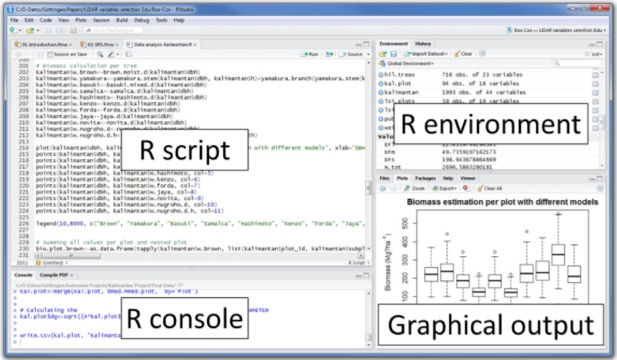

```{r setup, include=FALSE}
knitr::opts_chunk$set(echo = TRUE)
```

## Dlaczego R ?

Nauka o danych to jedna z najszybciej rozwijających się dyscyplin. Łączy ze sobą analizę danych z programowaniem. Mimo, iż istnieje wiele języków programowania to w R zrobisz bardzo szybko wiele analiz statystycznych oraz modeli. 

R to język programowania stworzony przez Ross'a Ihaka oraz Roberta Gentleman'a na Uniwersytecie Auckland w Nowej Zelandii w 1993 roku. Oparty na licencji GNU GPL co pozwala na jego używanie nawet w komercyjnych rozwiązaniach. Początkowo służył on jako język uczący statystyki na uczelniach, jednak otwartość kodu spowodowała, iż R szybko stał się bardzo popularnym językiem z tysiącami pakietów do dyspozycji użytkowników.   


[https://spectrum.ieee.org/static/interactive-the-top-programming-languages-2019](https://spectrum.ieee.org/static/interactive-the-top-programming-languages-2019)


## Instalacja oprogramowania R, R Studio. 


- Install R <https://cran.r-project.org/bin/windows/base/> (latest version 4.0.3, 2020-11-10)

- Install R Studio <https://www.rstudio.com/products/rstudio/download/> (latest 1.3.1093, 2020-11-10)

- Sprawdzenie wersji (R or R Studio):
```{r ver}
version
```


### RStudio


### Globalne opcje RStudio

> Menu Tools -> Global Options

### DEMO Pakietów R

```{r demo, eval=FALSE}

demo(persp)
demo(graphics)
demo(Japanese)

library(lattice)
demo(lattice)

demo(lm.glm)

```

### Pakiety i środowisko

```{r install, eval=FALSE}
# install
install.packages("dplyr")
# install from github
devtools::install_github("pbiecek/PrzewodnikPakiet")
# load 
library(dplyr)
# check version
packageVersion("dplyr")
# get the list of all installed packages
library()
# get the list of all loaded packages
search()
# main folder
getwd()
# setwd() - choose main folder
# check files
list.files()
```

Możesz również zainstalować i używać R Studio z pakietu [Anaconda](https://www.anaconda.com/download/).


Wszystkie aktualnie stworzone zmienne można znaleźć za pomocą funckji:

```{r}
x <- 4
y <- "napis"
# all features
ls()
# delete features from environment
rm(x)
ls()
```

> *Zadanie domowe* 
> zaznajomić się z [R Markdown](https://www.youtube.com/watch?v=MIlzQpXlJNk) 


## Podstawowe operacje programistyczne

W R możesz wykonywać wszystkie podstawowe operacje arytmetyczne. 

```{r}
1+1
3^2
sin(pi/2)
sqrt(16)
(1+5)*4
```

#### Przypisywanie zmiennych

```{r}
x <- 13
y <- 3

# sprawdz wartosc x
x

x+y

z <- x*y
q <- x^4*z

```
#### typy zmiennych
```{r}
x <- 2L
typeof(x)
x <- 2
typeof(x)

y <- 3.4
typeof(y)

test <- T
typeof(T)

isTRUE(test)

napis <- "Hello"
napis2 <- "Seba"

message <- paste(napis, napis2)
message
```


#### operatory porównania

```{r}
x <= y

# !!! pamiętaj = to nie to samo co ==
x == y

x > y
```
