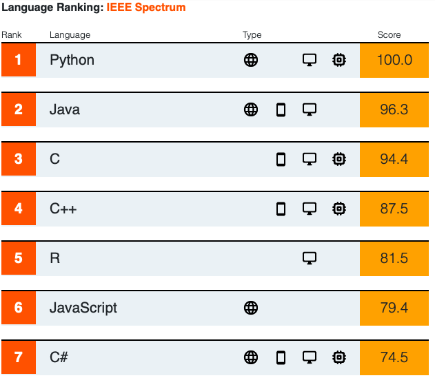
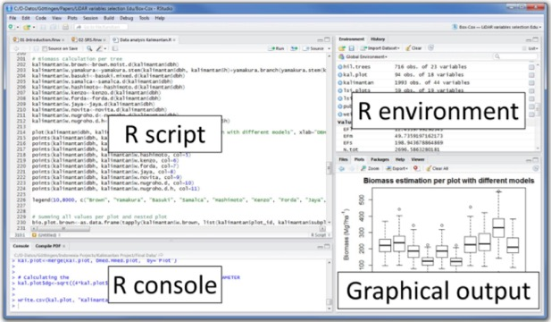
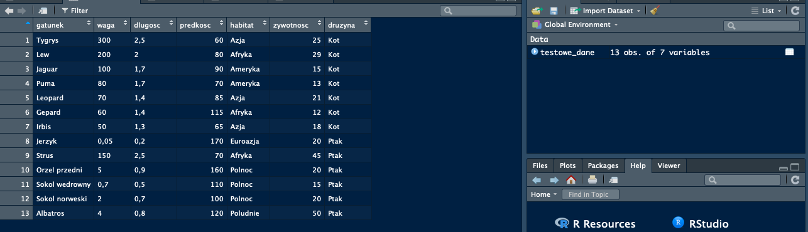

```{r setup, include=FALSE}
knitr::opts_chunk$set(echo = TRUE)
```

## Dlaczego R ?

Nauka o danych to jedna z najszybciej rozwijających się dyscyplin. Łączy ze sobą analizę danych z programowaniem. Mimo, iż istnieje wiele języków programowania to w R zrobisz bardzo szybko wiele analiz statystycznych oraz modeli. 

R to język programowania stworzony przez Ross'a Ihaka oraz Roberta Gentleman'a na Uniwersytecie Auckland w Nowej Zelandii w 1993 roku. Oparty na licencji GNU GPL co pozwala na jego używanie nawet w komercyjnych rozwiązaniach. Początkowo służył on jako język uczący statystyki na uczelniach, jednak otwartość kodu spowodowała, iż R szybko stał się bardzo popularnym językiem z tysiącami pakietów do dyspozycji użytkowników.   



[https://spectrum.ieee.org/static/interactive-the-top-programming-languages-2019](https://spectrum.ieee.org/static/interactive-the-top-programming-languages-2019)


## Instalacja oprogramowania R, R Studio. 


- Install R <https://cran.r-project.org/bin/windows/base/> (latest version 3.6.1, 2019-07-05)

- Install R Studio <https://www.rstudio.com/products/rstudio/download/> (latest 1.2.5001, 2019-09-19)

- Sprawdzenie wersji (R or R Studio):
```{r ver}
version
```


### RStudio


### Globalne opcje RStudio

> Menu Tools -> Global Options

### DEMO Pakietów R

```{r demo, eval=FALSE}

demo(persp)
demo(graphics)
demo(Japanese)

library(lattice)
demo(lattice)

demo(lm.glm)

```

### Pakiety i środowisko

```{r install, eval=FALSE}
# install
install.packages("dplyr")
# install from github
devtools::install_github("pbiecek/PrzewodnikPakiet")
# load 
library(dplyr)
# check version
packageVersion("dplyr")
# get the list of all installed packages
library()
# get the list of all loaded packages
search()
# main folder
getwd()
# setwd() - choose main folder
# check files
list.files()
```

Możesz również zainstalować i używać R Studio z pakietu [Anaconda](https://www.anaconda.com/download/).


Wszystkie aktualnie stworzone zmienne można znaleźć za pomocą funckji:

```{r}
x <- 4
y <- "napis"
# all features
ls()
# delete features from environment
rm(x)
ls()
```

> *Zadanie domowe* 
> zaznajomić się z [R Markdown](https://www.youtube.com/watch?v=MIlzQpXlJNk) 


## Podstawowe operacje programistyczne

W R możesz wykonywać wszystkie podstawowe operacje arytmetyczne. 

```{r}
1+1
3^2
sin(pi/2)
sqrt(16)
(1+5)*4
```

#### Przypisywanie zmiennych

```{r}
x <- 13
y <- 3

# sprawdz wartosc x
x

x+y

z <- x*y
q <- x^4*z
```

#### operatory porównania

```{r}
x <= y

# !!! pamiętaj = to nie to samo co ==
x == y

x > y
```

### Struktury danych

W odróżnieniu od innych języków programowania w R podstawową strukturą danych jest _wektor_. (Jakie znasz podstawowe struktury w innych językach ?).

**Wektor** to sekwencja wartości tego samego typu (liczb, stringów, wartości logicznyc itp). Jedna liczba to wektor jednoelementowy. 

Wektor tworzymy wykorzystując funkcję `c()` (ang. column)

```{r}
# vector z liczb 1,2 oraz 3
c(1,2,3)
# wektor z wartosciami tekstowymi
c("hello", "kolokwium",'zadanie')
```

Wektory można tworzyć jako gotowe sekwencje. 
```{r}
1:10

-3:5

seq(from=0, to=300, by=12)

seq(1,2,length.out = 10)

```

Jakiego typu wartości otrzymamy jeżeli utworzymy następujący wektor ?  
```{r}
c(1, "napis", 4.21, TRUE)

```

Podstawowe typy wektorów to: 

- `logiczne` TRUE oraz FALSE (wielkość liter ma znaczenie)
- `integer` liczby całkowite
- `numeric` liczby rzeczywiste
- `complex` liczby zespolone
- `character` tekst

Aby sprawdzić jakiego typu jest obiekt użyj metody `class()`.

```{r}
x <- 1:5
class(x)
y <- c("aaa", "foo")
class(y)
```


#### Operacje na wetkorach

Aby sprawdzić ile elementów zawartych jest w wektorze korzystamy z metody `length()`.

```{r}
x
length(x)
y
length(y)
```

```{r}
z <- c(3,2,3,5,2,0,9,-7,0,20)

sort(z)

sort(z, decreasing = TRUE)


rev(z)

unique(z)
```


Każdemu elementowi wektora można przypisać etykietę. 

```{r}
wzrost <- c(jan=178, pier=163, anna=157, john=198)

wzrost

names(wzrost)

```

Jeżeli mamy do dyspozycji dwa wektory:
```{r}
x <- c(2,5,6,2,1)
y <- c(1,4,2,4,1)

result.add <- x + y

print(result.add)

x < y

exp(-x^2) + cos(y)

# a co jeśli ? 
3+ x

z <- c(2,3)
z + y
```

#### Przydatne gotowe wektory


```{r}
month.name

LETTERS

letters
```

#### Indeksowanie

```{r}
LETTERS[4:9]

letters[ c(1,5,8:12) ]

```

Jak wybrać co drugi element ? 

```{r}
# indeksy
co_drugi <- seq(from=1, to=length(LETTERS), by=2)
# wartosci
LETTERS[ co_drugi ]
```

Wartości ujemne w indeksach wskazują, które elementy chcemy pominąć
```{r}
month.name[ -(6:8)]
```

Możemy korzystać również z przypisanych nazw
```{r}
wzrost <- c(jan=178, pier=163, anna=157, john=198)

wzrost[ c("jan", "anna") ]
```

Inną bardzo przydatną własnością jest możliwość zdefiniowania warunku logicznego

```{r}
wzrost[ wzrost > 165]
```

### RAMKI DANYCH

```{r}
?iris
# przykładowa ramka danych
data("iris")
# pierwsze 3 elemetny
head(iris,3)

# the number of rows
nrow(iris)

# the number of columns
ncol(iris)

# both
dim(iris)
# names of the columns
names(iris)
# summary
summary(iris)
# short summary
str(iris)
```

#### Indeksowanie Ramki Danych

Wiersze

```{r}
iris[ c(1,4,5) , ]
```

Kolumny

```{r}
iris[ c(1,4,5) , 2:4]
```
```{r}
iris[, "Sepal.Length"]

iris[ iris[, "Sepal.Length"]<5, ]

iris[ iris[, "Sepal.Length"]<5, c("Sepal.Length","Species")]

iris$Sepal.Width

iris$nowy <- iris$Sepal.Width*2

iris[ iris[, "Sepal.Length"]<5, c("Sepal.Length","nowy","Species")]
```

### Tworzenie ramki danych z wektorów 

```{r}
FamilyNamas <- c('Ojeciec', 'Matka','siostra','brat','pies')
FamilyAge <- c(53,52,15,8,3)
FamilySex <- c('M','F','F','M','F')
FamilyWeights <-c(92, 67, 45, 15, 3)

Family <- data.frame(FamilyNamas,FamilyAge, FamilySex,FamilyWeights)

str(Family)

summary(Family)

Family$FamilyAge

```

## Wczytywanie danych z plików tekstowych

Bardzo często dane przechowywane są w płaskich plikach tekstowych. Pliki tego typu to nie tylko pliki z rozszerzeniem `txt`. Są to wszystkie pliki, które zawierają tekst. Można otworzyć je w dowolnym edytorze tekstowym (również w RStudio). Dane tabelaryczne najczęściej przechowuje się w plikach `csv`, `tsv`, `dat` lub `txt`. 

> Pamiętaj. Pliki z których wczytujesz dane nie muszą znajdować się na Twoim dysku. np  <https://sebastianzajac.pl/data/dane.csv>

W plikach `csv` dane oddzielone powinny być znakiem `,` ale często stosuje się również średnik `;`.

Funkcja pozwalająca wczytać dane z plików do RStudio to `read.table()`.

```{r}
testowe_dane <- read.table('https://sebastianzajac.pl/data/dane.csv', sep=';', header = TRUE)
# print all data
testowe_dane
```

W programie R Studio w prawym górnym oknie, zatytułowanym Environment wyświetlane są symbole widoczne w głównym środowisku. Dwukrotne kliknięcie na wskazany symbol spowoduje otwarcie okna prezentującego zawartość zmiennej. W ten sposób możemy szybko podejrzeć co wczytało się do zmiennej koty_ptaki. Z przyczyn wydajnościowych wyświetlanych jest tylko pierwsze 1000 wierszy i kilkaset kolumn. Tak więc dla dużych zbiorów danych wyświetlony będzie tylko fragment całego zbioru.




### Excel

> Zadanie 2 
> Za pomocą `Import Dataset` wczytaj dane z [excela](https://sebastianzajac.pl/data/dane2.xlsx).
>


## Czyszczenie i przetwarzanie danych

```{r}
library(dplyr)
library(Przewodnik)
```

Program R jest wyposażony w olbrzymią liczbę funkcji do przetwarzania danych. 

Hadley Wickham przygotował dwa pakiety, dplyr i tidyr które w sumie udostępniają jedynie kilka funkcji, jednak te funkcje można na tyle elastycznie łączyć, że w sumie pozwalają one na wykonanie większości typowych operacji na danych.

Funkcje w tych pakietach nazwał czasownikami a proces analizy danych przyrównał do konstrukcji zdania. Podstawowymi czasownikami są

- filter() - wybieranie wierszy,
- select() - wybieranie kolumn,
- arrange() - sortowanie wierszy,
- group_by() - określanie grup,
- summarise() - liczenie agregatów,
- gather() / spread() - przechodzenie pomiędzy postaciami wąską a szeroką w danych.

### Filtrowanie wierszy

Jedną z najczęstszych operacji na danych jest filtrowanie wierszy, które spełniają określony warunek / warunki.

Funkcja `filter()` pakietu dplyr wykonuje filtrowanie. Jej pierwszym argumentem jest zbiór danych na których ma pracować, a kolejne argumenty to warunki logiczne.

Wynikiem tej funkcji są wiersze spełniające wszystkie określone warunki logiczne. Określając warunki można wykorzystywać nazwy kolumn ze zbioru danych bez podawania dodatkowych odnośników.

```{r}

tmp <- filter(auta2012, Marka=='Porsche')
head(tmp)
```

Dodatkowe warunki:

```{r}
tylkoPorscheZDuzymSilnikiem <- filter(auta2012,
         Marka == "Porsche",
         KM > 300)
head(tylkoPorscheZDuzymSilnikiem)
```

### Filtrowanie kolumn

Dane potrafią zawierać dużą liczbę kolumn. Ale często pracujemy tylko na kilku z nich. Usunięcie pozostałych spowoduje, że dane będą mniejsze i operacje na nich będą szybsze.

Inną zaletą wybierania jedynie potrzebnych kolumn jest łatwiejsze wyświetlanie danych. Zamiast pokazywać wszystkie, nawet nieistotne kolumny, często lepiej pokazać jedynie te istotne.

Funkcja select() z pakietu dplyr pozwala na wybór jednej lub wielu zmiennych ze źródła danych. Pierwszym argumentem jest źródło danych a kolejnymi są nazwy kolumn, które mają być wybrane. Przykładowo, poniższa instrukcja wybiera jedynie rodzaj paliwa i rok produkcji.

```{r}
tmp <- select(auta2012, Rodzaj.paliwa, Rok.produkcji)
head(tmp)
```

Poza wskazywaniem wszystkich kolumn przez nazwę można również korzystać z operatora negacji - (wszystkie kolumny poza wskazanymi) lub z funkcji `matches()`, `starts_with()`, `ends_with()` pozwalających na definiowanie grup nazw kolumn spełniających określone warunki

```{r}
tmp <- select(auta2012, starts_with("Cena"))
head(tmp)
```

### Tworzenie nowych kolumn

Modelowanie czy przetwarzanie danych często wymaga tworzenia nowych zmiennych na bazie istniejących. Czasem na podstawie ceny buduje się logarytm ceny (jedna kolumna z jednej kolumny), czasem na podstawie wagi i wzrostu liczy się BMI (jedna zmienna z kilku zmiennych).

Funkcja `mutate()` z pakietu dplyr pozwala na wygodne tworzenie dodatkowych kolumn w zbiorze danych na podstawie innych istniejących już kolumn.

Przedstawmy działanie tej funkcji na przykładzie danych auta2012 o samochodach. w pierwszym przykładzie policzymy wiek auta (a ponieważ przedstawione ogłoszenia pochodzą z 2013 roku to wiek będzie równy 2013 - rok produkcji).

Kolejny przykład przekształca dwie kolumny w jedną. Na podstawie ceny w PLN oraz informacji czy jest to cena brutto czy netto policzymy odpowiednik ceny brutto dla wszystkich ofert.

```{r}

autaZWiekiem <- mutate(auta2012,
                       Wiek.auta = 2019 - Rok.produkcji)
head(autaZWiekiem[,c("Wiek.auta", "Rok.produkcji")])
```

Przetwarzanie kolumn może być bardziej złożone i może dotyczyć zmiennych które nie są liczbami. Na poniższym przykładzie wykorzystujemy funkcją grepl() wyznaczająca wektor wartości TRUE/FALSE w zależności od tego czy w analizowanym napisie występuje określony wzorzec.

Na podstawie kolumny Wyposazenie.dodatkowe wyznaczany binarne zmienne opisujące czy dane auto ma autoalarm, centralny zamek kub klimatyzację.

```{r}
autaZWyposazeniem <- mutate(auta2012,
         Autoalarm = grepl(pattern = "autoalarm", Wyposazenie.dodatkowe),
         Centralny.zamek = grepl(pattern = "centralny zamek", Wyposazenie.dodatkowe),
         Klimatyzacja = grepl(pattern = "klimatyzacja", Wyposazenie.dodatkowe))

head(autaZWyposazeniem)
```


### Sortowanie 

Sortowanie danych po określonej kolumnie znacznie ułatwia analizę wartości w tej kolumnie. Przede wszystkim natychmiast widać wartości skrajne, sortowanie jest więc wygodne podczas eksploracji danych.

Funkcją arrange() z pakietu dplyr możemy wykonać sortowanie po jednej lub większej liczbie zmiennych. W przypadku remisów ze względu na pierwsze kryteria, porządek rozstrzygają kolejne kryteria.

W przykładzie poniżej w pierwszej kolejności dane są sortowane po wartościach z kolumny Model. Dopiero w przypadku, gdy w tej kolumnie znajdują się takie same wartości, ich kolejność jest rozstrzygana przez kolejną zmienną, cena w PLN

```{r}
posortowaneAuta <- arrange(auta2012, Model, Cena.w.PLN)

head(select(posortowaneAuta, Model, Marka, Cena.w.PLN, Cena, Waluta))

```


### Kategoryjne operatory potoków 

Rozwiązaniem problemu cebulki jest stosowanie specjalnego operatora do przetwarzania potokowego %>%. Ten operator pochodzi z pakietu magrittr (cytując z jego dokumentacji: to be pronounced with a sophisticated french accent) i jest dostępny po włączeniu pakietu dplyr.

Instrukcja a `%>% f(b)` jest równoważna instrukcji `f(a, b)`.

Można też opisać go następująco: Operator przekazuje lewą stronę jako pierwszy argument funkcji wskazanej z prawej strony.

```{r}
auta2012 %>%                                    # weź dane o autach
  filter(Marka == "Volkswagen") %>%             # pozostaw tylko Volkswageny
  arrange(Cena.w.PLN) %>%                       # posortuj malejąco po cenie
  filter(Model == "Golf", Wersja == "IV") %>%   # pozostaw tylko Golfy VI
  filter(Przebieg.w.km < 50000) ->              # pozostaw tylko auta o małym przebiegu
  tylkoMalyPrzebieg

head(tylkoMalyPrzebieg[,1:9])
```

Funkcje z pakietu dplyr są tak zdefiniowane by pierwszym argumentem był zawsze zbiór danych. Przez to domyślne zachowanie operatora %>% pozwala na taki skrótowy zapis.

Dla funkcji, które zbiór danych przyjmują jako drugi lub kolejny argument można miejsce gdzie należy wstawić lewą stronę operatora %>% wskazać symbolem ..

W poniższym przykładzie zbiór danych iris zostanie wstawiony do jako argument data= ponieważ to miejsce wskazuje symbol ..

```{r}
iris %>%
  lm(Sepal.Length~Species, data=.) %>%
  coef
```

### Agregaty 

Funkcją `summarise()` można wyznaczyć agregaty w danych.

Przykładowo, poniższa instrukcja dla zbioru danych auta2012 liczy średnią cenę, pierwiastek z wariancji ceny i medianę przebiegu aut.

```{r}
auta2012 %>%
  summarise(sredniaCena = mean(Cena.w.PLN),
            sdCena = sqrt(var(Cena.w.PLN)),
            medianaPrzebiegu = median(Przebieg.w.km, na.rm=TRUE))
```

Nie zawsze agregat związany jest z przekształceniem wartości w jakiejś kolumnie. Przykładowo, dosyć przydatną statystyką jest liczba wierszy, która nie zależy od wartości w danych. Taki agregat można wyznaczyć funkcją n().

Wyznaczając agregaty możemy składać funkcje. Przykładowo składając mean() i grepl() możemy policzyć procent aut z określonym elementem wyposażenia.

```{r}
auta2012 %>%
  summarise(liczba.aut.z.klimatyzacja = sum(grepl("klimatyzacja", Wyposazenie.dodatkowe)),
            procent.aut.z.klimatyzacja = 100*mean(grepl("klimatyzacja", Wyposazenie.dodatkowe)),
            procent.aut.z.automatem = 100*mean(Skrzynia.biegow == "automatyczna"),
            liczba.aut = n())
```

Funkcja `group_by()` pozwala określić w jakich grupach mają być liczone agregaty wyznaczane przez funkcję summarise().

Sama funkcja nie powoduje żadnego przetwarzania, a jedynie dodaje znacznik określający co jest teraz zmienną grupującą. Kolejne funkcje w potoku (tj. summarise()) będą dzięki temu znacznikowi wiedziały, że statystyki należy wyznaczać w grupach.

Poniższy przykład liczy trzy statystyki (medianę ceny, przebiegu i liczbę wierszy) dla poszczególnych typów paliwa.


```{r}
auta2012 %>%
  filter(Marka == "Volkswagen", Rok.produkcji == 2007) %>%
  group_by(Rodzaj.paliwa) %>%
  summarise(medianaCeny = median(Cena.w.PLN, na.rm=TRUE),
            medianaPrzebieg = median(Przebieg.w.km, na.rm=TRUE),
            liczba = n())
```

Agregaty są zwykłą ramką danych, można wykonywać na nich kolejne operacje, np. sortowanie.

```{r}
auta2012 %>%
  filter(Marka == "Volkswagen", Rok.produkcji == 2007) %>%
  group_by(Rodzaj.paliwa) %>%
  summarise(medianaCeny = median(Cena.w.PLN, na.rm=TRUE),
            medianaPrzebieg = median(Przebieg.w.km, na.rm=TRUE),
            liczba = n()) %>%
  arrange(liczba)

```

I jeszcze jeden przykład:

```{r}
auta2012 %>%
  filter(Rok.produkcji == 2007, Marka == "Volkswagen") %>%
  group_by(Model, Rodzaj.paliwa) %>%
  summarise(medianaCeny = median(Cena.w.PLN, na.rm=TRUE),
            medianaPrzebieg = median(Przebieg.w.km, na.rm=TRUE),
            liczba = n())

```

### ZADANIA 

Aby zweryfikować znajomość pakietów dplyr i tidyr spróbuj rozwiązać poniższe 20 zadań. Kolejność odpowiada stopniowi trudności. Pierwsze zadania można rozwiązać stosując pojedyncze operacje, ostatnie wymagają połączenia większej liczby cegiełek.

Wszystkie one dotyczą zbioru danych auta2012 dostępnego w pakiecie PogromcyDanych.

1. Która Marka występuje najczęściej w zbiorze danych auta2012?
2. Spośród aut marki Toyota, który model występuje najczęściej.
3. Sprawdź ile jest aut z silnikiem diesla wyprodukowanych w 2007 roku?
4. Jakiego koloru auta mają najmniejszy medianowy przebieg?
5. Gdy ograniczyć się tylko do aut wyprodukowanych w 2007, która Marka występuje najczęściej w zbiorze danych auta2012?
6. Spośród aut marki Toyota, który model najbardziej stracił na cenie pomiędzy rokiem produkcji 2007 a 2008.
7. Spośród aut z silnikiem diesla wyprodukowanych w 2007 roku która marka jest najdroższa?
8. Ile jest aut z klimatyzacją?
9. Gdy ograniczyć się tylko do aut z silnikiem ponad 100 KM, która Marka występuje najczęściej w zbiorze danych auta2012?
10. Spośród aut marki Toyota, który model ma największą różnicę cen gdy porównać silniki benzynowe a diesel?
11. Spośród aut z silnikiem diesla wyprodukowanych w 2007 roku która marka jest najtańsza?
12. W jakiej marce klimatyzacja jest najczęściej obecna?
13. Gdy ograniczyć się tylko do aut o cenie ponad 50 000 PLN, która Marka występuje najczęściej w zbiorze danych auta2012?
14. Spośród aut marki Toyota, który model ma największy medianowy przebieg?
15. Spośród aut z silnikiem diesla wyprodukowanych w 2007 roku który model jest najdroższy?
16. W jakim modelu klimatyzacja jest najczęściej obecna?
17. Gdy ograniczyć się tylko do aut o przebiegu poniżej 50 000 km o silniku diesla, która Marka występuje najczęściej w zbiorze danych auta2012?
18. Spośród aut marki Toyota wyprodukowanych w 2007 roku, który model jest średnio najdroższy?
19. Spośród aut z silnikiem diesla wyprodukowanych w 2007 roku który model jest najtańszy?
20. Jakiego koloru auta mają największy medianowy przebieg?


