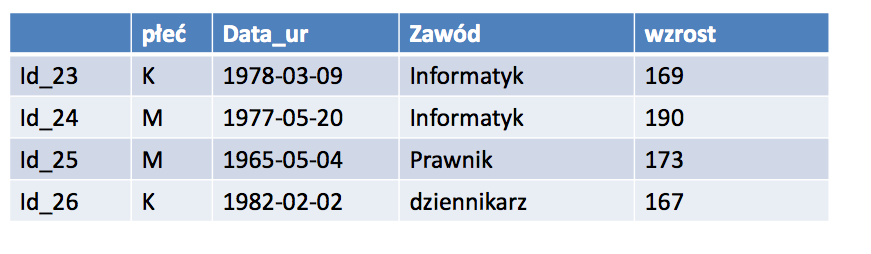
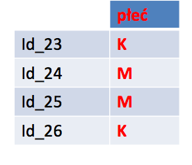
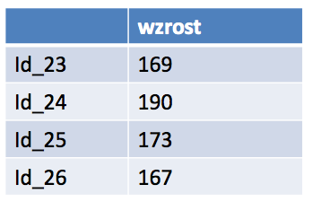
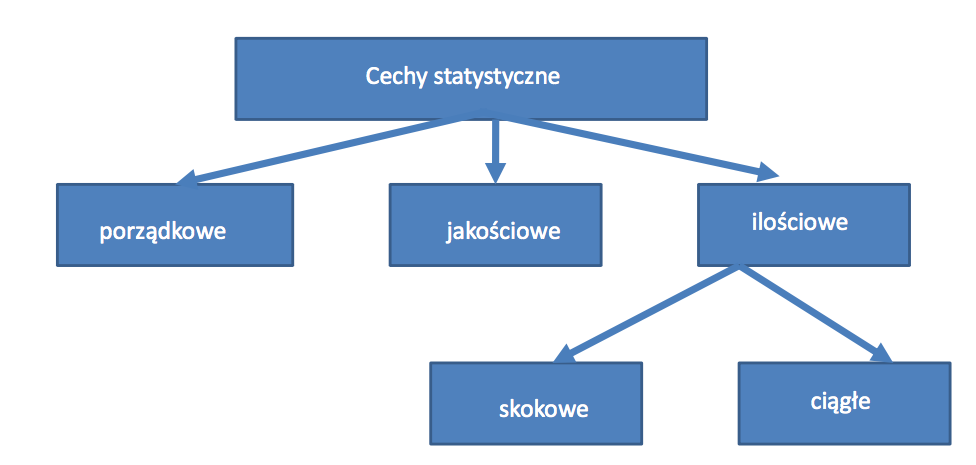
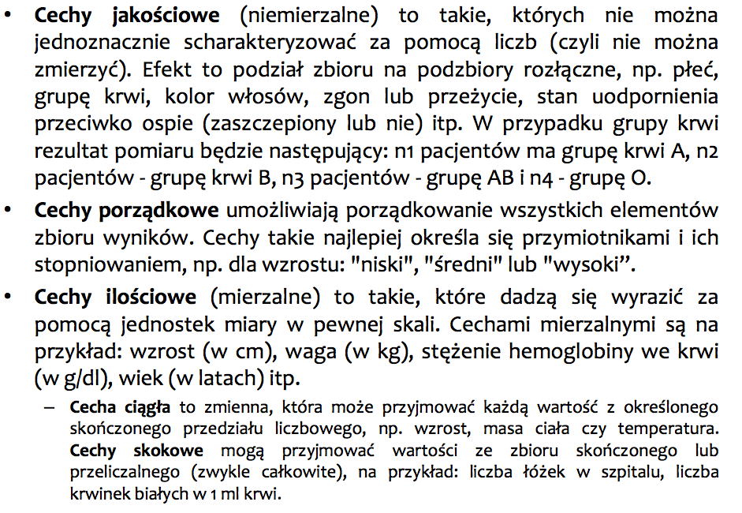
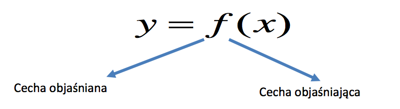
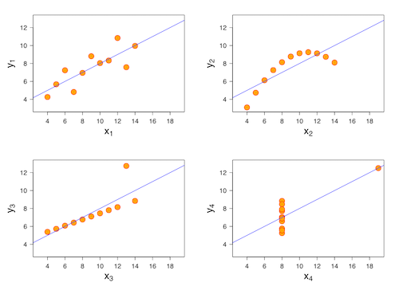

Analiza danych w R
========================================================
author: Sebastian Zając
date: 
autosize: true

Uczenie maszynowe (Machine Learning)
==============

Za pomocą ML identyfikujemy procesy, dzięki którym zdobywamy wiedzę nie zawsze możliwą do bezpośredniego wnioskowania z danych, a jednocześnie przydatną do podejmowania decyzji. Jest narzędziem stosowanym do wieloskalowego przetwarzania danych i świetnie nadaje się do obsługi złożonych zbiorów danych. Zdolność predykcji modeli ML wykorzystuje się bardzo często do systemów sztucznej inteligencji (**AI**).

1. Uczenie nadzorowane (_supervised_)
2. Uczenie nienadzorowane (_unsupervised_)
3. Uczenie przez wzmocnienie (_reinforcement learning_)

Algorytmy
===========
- regresja liniowa
- regresja logistyczna
- drzewa decyzyjne
- k-średnie
- naiwny Bayes
- ...

Sieci neuronowe
=================
 
Perceprton jako jednowarstwowa sieć w przód.

>> Zadanie
>> Kiedy powstała pierwsza sieć neuronowa (Perceptron) ?

>> Zadanie
>> Przypomnij sobie własności iloczynu skalarnego

Deep learning-zastosowanie praktyczne
==============

1. _AlphaGo_ to maszyna ze sztuczną intelignecją bazującą na uczeniu głębokim, która w 2016 roku pokonała mistrza w grze Go (Lee Sedol).

2. 2009 - Netflix system rekomendacji (nagroda 1 000 000 dolarów)

3. 2013 rok - wykorzystanie metod uczenia maszynowego do wykrywania i identyfikacji ptaków na podstawie danych dźwiękowych.

4. 2015 - Na podstawie dancyh o pogodzie, terenie, badaniach i opryskach przewidzieć kiedy i gdzie określone gatunki komarów przejdą pozytywny wynik  testu na roznoszenie wirusa Zachodniego Nilu.

Deep learning-zastosowanie praktyczne
==============
5. 2015 - Prognoza cen wynajmu mieszkań w Australii Zachodniej

6. 2016 - Przyśpieszenie procesu zarządzania reklamacjami

7. inne - pojazdy bezzałogowe, system rozpoznawania celów, systemy czytające notatki lekarskie, systemy wykrywania twarzy

BIG DATA 
============

technologia przetwarzania dużej ilości danych rozwijająca się od 2001 roku [Laney Douglas: 3D Data Management: Controlling Data Volume, Velocity and Variety](https://blogs.gartner.com/doug-laney/files/2012/01/ad949-3D-Data-Management-Controlling-Data-Volume-Velocity-and-Variety.pdf)

### 3V, a nawet 5V

- **Volume** - duże dane
- **Velocity** - szybko się zmieniające
- **Variety** - różnorodne, strukturyzowane i bez struktury.
- **Veracity** - prawdziwość
- **Value** - wartość

Główne idee:
=================

- Pozwól mówić danym
- Nie ważne dlaczego, ważne, że działa !
- not why, but what
- Najważniejsze, że da się zrobić i zarabiać na tym !!!
- Gromadźmy dane bez ich pierwotnego przeznaczenia

Niepowodzenia BIG Data
===============

- Brak dobrych business case
- Dane są zbierane, ale zbyt mało uzasadnia ich przydatność
- Lekceważenie problemów jakości danych
- Umniejszanie problemu wnioskowania na podstawie obciążonej próby
- Zbyt duży nacisk na technologię
- Złudne nadzieje szybkiego ,,klikania modelu''
- Brak inwestycji  w przygotowanie i wykształcenie inżyniera danych
- Dostęp do danych, nawet przykładowych

Szumnie o Big Data
===========================
Zachowaj sceptycyzm słysząc o Big Data gdyż:

1. Brak definicji najbardziej podstawowych terminów. Czym jest Big Data? Gdzie uprawia się Big Data ? Czy chodzi o naukę czy o technologię ? Ile to jest Big ? 
2. Brak poszanowania dla innych naukowców: od kiedy znana jest statystyka, matematyka, informatyka ? Big Data jest zawsze *NEW*, czy dane z Google tylko teraz są wielkie ? Szanuj wiedzę swoich poprzedników.
3. Nauka o danych - połączenie statystki i inżynierii technologicznej

Struktury Danych
========

Rozpatrzmy zbiór danych

Cechy jakościowe
================

płeć, grupa zawodowa - atrybuty nominalne (jakościowe)
- nie można z nich policzyć wartości średniej, min, max
- nie można uporządkować wartości w takim zbiorze.

Cechy ilościowe
==================

Wzrost, waga, dochód, liczba godzin - **atrybuty ilościowe (numeryczne)**
- można z nich policzyć wartość średnią, min, max
- można uporządkować wartości w takim zbiorze.

Typy danych
==============

Typy danych
==============

Cecha objaśniana i objaśniająca
====================

- Cecha objaśniana - jej wartość chcemy określić na podstawie cech objaśniających
- Cecha objaśniająca - opisuje obserwacje w zbiorze.

Podstawowe pojęcia
=============

1. **Stastystyka** zajmuje się zbieraniem i przetwarzaniem informacji. Nauka poświęcona metodom badania zjawisk masowych. Polega na systematyowaniu obserwowanych cech ilościowych i jakościowych oraz na przedstawieniu wyników w postaci tabel, wykresów itp. Teoria rachunku prawdopodobieństwa, teoria miary.
2. **Statystyka matematyczna** zajmuje się badaniem zbiorów na podstawie znajomości własności ich części (podzbiorów)
3. **Populacja** - zbiór obiektów z wyróżnioną cechą

Podstawowe pojęcia
=============

4. **Próba** - wybrana część populacji podlegająca pełnemu badaniu. Wynik badania przenosimy na populację. 
5. **Cecha** - wielkość losowa charakteryzująca obiekt danej populacji
6. **Zmienna losowa** - wielkość o wartościach rzeczywistych, określona na zbiorze zdarzeń elementarnych
7. **Dystrybuanta** - chcarakteryzuje rozkład zmiennej losowej

Podstawowe pojęcia
=============

4. **Rozkład zm losowej** - zbiór wartości zm losowej oraz prawdopodobieństwa z jakimi są przyjmowane. 
5. **Wartość oczekiwana** - (Średnia - liczba) $E(X)$ zmiennej losowej $X$. podstawowa charakterytyka rozkładu. 
6. **Wariancja** - $D^2(X)$ (liczba) charakteryzuje rozrzut wokół wartości oczekiwanej.
7. **Odch std** - $D(X)=\sqrt{D^2(X)}$

Metody opisu danych
===============

Statystyczne metody opisu danych:
- Opisowe statystyki: średnia, mediana, min, max, moda, odchylenie std, kurtoza ...
- Graficzne metody: box plot, histogram, scatter plot

O czym mówi $E(X)$ ?
==================

- Ile zarabiają dyrektorzy w działach sprzedaży ? _średnia zarobków dyr sprzedaży wynosi 12162 PLN_
- Czy można określić ile zarabia konkretny dyrektor ? 
- Czy dyrektorzy to bogaci ludzie ? 
- Czy można pliczyć średnią płeć dyrektorów ? 

O czym mówi Mediana ?
=================

- W jakim przedziale mieszczą się zarobki większości dyrektorów ? 
- Ile zarabia "przeciętny dyrektor ? (mediana ? NIE !!! Moda -> najczęściej występujący)
- Czy prawie wszyscy dyrektorzy to bogaci ludzie ? (Nie ! dalej nie wiemy nic o całości badanej grupy)
- Czy większość dyrektorów to bogaci ludzie ? (mediana)
- Jakie zarobki są najczęstsze wśród dyrektorów ? (moda)

Kwartet Anscombe'a
===================

**Francis Anscombe** - angielski statystyk. Studiował w Yale i Princeton. Pionier analizy wizualnej. 

