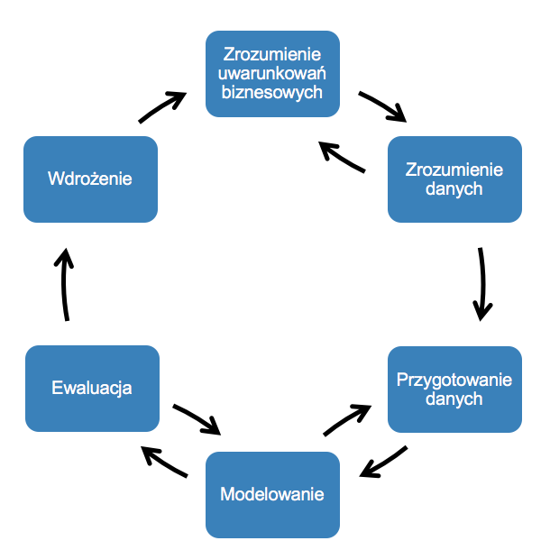
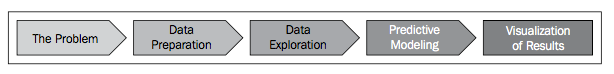

Na początku był ... **CHAOS**

# Szumnie o Big Data

Zachowaj sceptycyzm słysząc o Big Data gdyż:

1. Brak definicji najbardziej podstawowych terminów. Czym jest Big Data? Gdzie uprawia się Big Data ? Czy chodzi o naukę czy o technologię ? Ile to jest Big ? 
2. Brak poszanowania dla innych naukowców: od kiedy znana jest statystyka, matematyka, informatyka ? Big Data jest zawsze *NEW*, czy dane z Google tylko teraz są wielkie ? Szanuj wiedzę swoich poprzedników.
3. Nauka o danych - połączenie statystki i inżynierii technologicznej

Jeśli dysponujesz odpowiednimi danymi, prawidłowo przeprowadzona eksploracja danych pozwala zdobyć wiedzę, która w innym przypadku byłaby dostępna dopiero po fakcie. Prawdziwość uzyskanych informacji może być zmierzona i obiektywnie oceniona.

# Cel analizy danych

Cztery podstawowe cele każdej analizy danych 

**Zrozumieć, Przewidzieć, Sprawdzić, Zobaczyć**.

- __Zrozumieć__ to cel eksploracyjnej analizy danych. Wykorzystaj wykresy, tabele, modele aby poszerzyć wiedzę o zależnościach w danych.

- __Przewidzieć__ (analiza predykcyjna) przyszłe wartości zmiennej na podstawie innych zmiennych. Wyróżniamy dwa podejścia - czarna skrzynka (bez modelu) oraz biała skrzynka (z modelem ). 

- __Sprawdź__ czy twoje hipotezy są prawidłowe za pomocą testów statystycznych. 

- __Zobaczyć__ opis zjawiska poprzez wykresy.   

# Metodyka CRISP-DM

**CRoss Industry Standard Process for Data Mining**:

Określony w 1996 standardowy proces dopasowania eksploracji danych do ogólnej strategii rozwiązywania problemów komórki biznesowej lub badawczej.

## Zrozumienie problemu

Jasne sformułowanie celów i wymagań projektu w terminologii komórki biznesowej. Stworzenie wstępnego planu działania. Wstępna analiza czy posiadane dane pozwolą uzyskać odpowiedź na problem.

## Zrozumienie danych

Zebranie surowych danych. Wstępna analiza danych, odkrycie pierwszych zależności. Ocena jakości danych. Wybranie interesujących podzbiorów danych. Znając problem, możemy ocenić czy dostępne dane pozwolą go rozwiązać. Na tym etapie może okazać się, że dane są niezrozumiałe, wtedy konieczne jest zasięgnięcie opinii ekspertów w danej dziedzinie (np. pracowników firmy).

## Przygotowanie danych

Przygotowanie ostatecznego zrobiu danych - **najbardziej czasochłonny i pracochłonny etap**. Wykonanie koniecznych przekształceń danych. Wyczyszczenie danych. Pierwszy etap eksploracji danych, często zautomatyzowany.

## Modelowanie

Wybór i zastosowanie odpowiednich technik medelujących i modeli. Dobór parametrów modelu. Często powrót do poprzednich faz, aby dostosować dane do wybranych technik.

## Ewaluacja

Ocena modelu pod kątem jakości, efektywności, wiarygodności oraz przydatności. Ustalenie czy model spełnia postawione wymagania. Decyzja o wdrożeniu bądź powrót do poprzednich etapów.

## Wdrożenie

Wykorzystanie modelu. Sporządzenie raportu. Stworzenie aplikacji wykorzystującej model.

**Proces eksploracji danych NIE sprowadza się do zastosowania wyrafinowanych algorytmów do posiadanych danych**. Wręcz przeciwnie, tworzenie modeli z reguły zajmuje $10\%$ czasu projektu.

# Odkrywanie wiedzy

**Etapy w procesie odkrywania wiedzy**:

1. Czyszczenie danych (data cleaning) - pozbądź się nieistotnych, niepełnych, niepoprawnych danych.
2. Integracja danych (data integration) - łączenie danych z różnych źródeł w jeden zintegrowany zbiór.
3. Selekcja danych (data selection) - selekcja danych istotnych z punktu widzenia procesu analizy.
4. Konsolidacja i transformacja danych (data transformation) - przekształcenie wybranych danych do postaci wymaganej przez metody eksploracji danych.
5. Eksploracja danych - odkrywanie potencjalnie użytecznych wzorców
6. Ocena modeli (pattern evaluation) - ocena i identyfikacja ciekawych wzorców.
7. Wizualizacja modeli

**Eksploracja danych** to jeden z etapów procesu odkrywania wiedzy. Pozostałe etapy to przygotowanie danych, selekcja, czyszczenie, definiowanie dodatkowej wiedzy przedmiotowej, interpretacja wyników eksploracji, wizualizacja.

W hurtowniach danych wiele z tych etapów (ETL) są zautomatyzowane.

Wzorce zazwyczaj są prezentowane ale można je również przechowywać w bazach danych.

# Mity w Data Mining

* Istnieją gotowe narzędzia, które potrafią wykorzystać dane do rozwiązywania problemów.
* Proces Data Mining może być w pełni zautomatyzowany, można go szybko wyklikać i nie wymaga nadzoru.
* Eksploracja danych zwraca się szybko.
* Pakiety oprogramowania do Data Mining są intuicyjne i łatwe w użyciu.
* Data Mining automatycznie wyczyści niechlujną bazę danych.
* Data Mining zidentyfikuje nasze problemy oraz ich przyczyny.

# Klasyfikacja metod eksploracji danych

## Modele deskrypcyjne

Zadaniem każdego modelu powstającego podczas eksploracji danych jest dostarczenie pewnych wyjaśnień **nawet jeżeli nie jest on używany do opisywania zależności, to wyniki bazują na wydobytych z tych danych informacji**. Modele te mają opowiadać użytkownikom o tym kim są klienci firmy, jak podejmują decyzje o skorzystaniu z usług firmy, jak wygląda proces produkcji itp. Prezentowane w postaci terminów biznesowych a nie samych danych. Wskazują nietypowe przypadki i zjawiska. 

## Modele predykcyjne

Zadaniem modeli predykcyjnych jest jak najdokładniejsze i możliwie wiarygodne uzupełnienie brakujących danych. Np. ocena ryzyka udzielenia pożyczki, wielkość zysków firmy, czas bezawaryjnego działania urządzeń.

### UWAGA. Procesy tworzenia modeli predykcyjnych i deskrypcyjnych nie różnią się od siebie.

Ze względu na cel eksploracji metody dzielimy na:

1. Odkrywanie asocjacji. Inaczej nazywana analizą koszykową (market basket analysis). Wykrywanie elementów występujących razem w określonych transakcjach oraz określenie reguł decydujących o pojawieniu się danych zestawów.
2. Klasyfikacja. Polega na znalezieniu sposobu odwzorowania danych w zbiór predefiniowanych klas. Stosowane w rozpoznawaniu obiektów, scoring bankowy, rozpoznawanie trendów. Bazuje głównie na drzewach decyzyjnych, regresji logistycznej, klasyfikatorach Bayes'a, sieciach  neuronowych, SVM i innych.
3. Regresja. Podobna do klasyfikacji dla zmiennych ciągłych.
4. Grupowanie (segmentacja, clustering). Algorytm wybierający atrybuty decydujące o przynależności do danej klasy. Realizowany jako proces iteracyjny (przerywany, gdy granice grup są stabilne). Na jego podstawie opisujemy dane jako zbiór rozłącznych kategorii.
5. Analiza sekwencji i przebiegów czasowych Odkrywanie charakterystyk. Analiza ruchu sieci web, wyodrębnienie zdarzeń występujących w sekwencji
6. Eksploracja tekstu
7. Eksploracja grafów i sieci społecznościowych 
8. Eksploracja danych multimedialnych wykrywanie punktów osobliwych

## Zastosowania

Początkowo analizowano proste typy danych: liczby, łańcuchy, daty.

Obecnie analizuje się :

1. Multimedia: zdjęcia, filmy, muzyka
2. Dane przestrzenne: mapy.
3. Tekst
4. Szeregi czasowe
5. Grafy
6. Sieci społecznościowe
7. Struktury chemiczne, RNA, DNA, białka

# Prawdopodobieństwo sukcesu projektu eksploracji danych

## [Busines Case Study](http://helion.pl/add111546~sqlsme) 

Firma Y planuje wprowadzić na rynek nową serię produktów. Na podstawie swojego dotychczasowego działania i doświadczenia oszacowała ona szansę powodzenia tych produktów na $10\%$. Oszacowanie to wzięto z informacji, iż dotychczas 1 na 10 produktów odnosił sukces. Czyli 9 na 10 produktów ponosi porażkę. Firma zwraca się do nas o pomoc, gdyż chce zwiększyć prawdopodobieństwo sukcesu. **Do dzieła zacznij budować swoje modele eksploracji danych.**

### Co proponujesz ?

Na początku udajmy się do działu marketingu z prośbą przeprowadzenia testów pozwalających lepiej ocenić szanse powodzenia danej serii produktów. (Testy te pozwolą wybrać produkty mające największą szansę na sukces rynkowy). Posiadane przez firmę Y dane z historii sprzedaży wraz z wynikami testów posłużą nam jako dane źródłowe.

Po zbudowaniu i przetestowaniu modelu eksploracji danych udaje nam się uzyskać predykcję o dokładności $80\%$, czyli nasz model właściwie ocenia szanse powodzenia 8 na 10 przypadków. Jednocześnie w 3 przypadkach na 10 model ocenia jako udane premiery które zakończyły się niepowodzeniem. Czyli procent prawidłowych predykcji naszego modelu wynosi $80\%$, a procent błędów typu beta (przyjęcie fałszywej hipotezy) wynosi $30\%$.

Przypuśćmy, że nasz model pozytywnie ocenił wprowadzenie na rynek analizowanej serii produktów (ocena ta została pozytywnie i optymistycznie przyjęta przez dyrekcję firmy Y). Firma agresywnie inwestuje i przygotowuje promocję nowej serii produktów ($80\%$ szans sukcesu !). Okazuje się jednak, że jedynie co trzeci produkt odniósł sukces, a koszty kampanii promocyjnej ledwo się zwróciły. Wina za tą sytuację (oczywistość) spada na Nas. Gdzie popełniono błąd ? 

Pomyliliśmy dokładność modelu ($80\%$) z jego skutecznością w rozwiązywaniu postawionego problemu. Załóżmy , że nowa seria liczyła 100 produktów, a szanse na sukces każdego z nich, zarówno obliczone z modelu jak i ocenione na podstawie świadczeń firmy, są dokładnie takie same jak szanse sukcesu pozostałych produktów z tej serii.

1. Ze 100 należących do nowej serii produktów 10 odniesie sukces, a 90 porażkę. 
2. $30\%$ z tych 90 odrzuconych przez rynek produktów (27) nasz model błędnie ocenił jako rynkowy hit. 
3. $80\%$ z 10 rzeczywiście zyskownych produktów (8) model ocenił pozytywnie.
4. Dwa produkty model błędnie ocenił jako odrzucone przez rynek.

|                  | Przewidywany sukces | Przewidywana porażka |
| ---------------- |:-------------------:|:--------------------:|
| Sukces rynkowy   | $10*0.8 = 8$       |    $10*0.2 = 2$       |
| Porażka rynkowa  | $90*0.3 = 27$      |    $90*0.7 = 63$      |

Analizowana seria produktów została uznana za mającą szansę na odniesienie sukcesu na rynku, więc wszystkie należące do niej produkty znalazły się w pierwszej kolumnie tabeli. Za rynkowe hity model uznał jedynie 35 produktów, z czego tylko 8 było rzeczywistym sukcesem. Szansa na powodzenie nowego produktu wynosi więc $8/27 \sim 30\%$. Mimo, iż projekt zakończył się niepowodzeniem z powodu błędnej oceny to prawie trzy krotnie zwiększyliśmy szansę na rynkowy sukces nowej serii (na początku było $10\%$).

> Sukces projektu nie zależy od zbudowania dokładnych i wiarygodnych modeli eksploracji danych, ale od tego czy uzyskane wyniki pozwolą rozwiązać istniejący problem.
