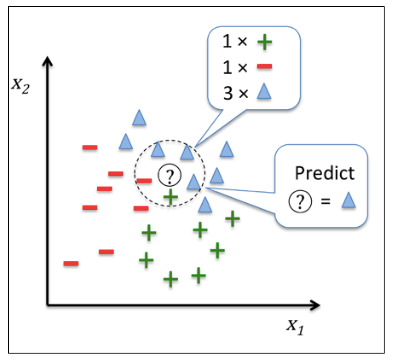

## Jeszcze raz o danych

Z poprzednich wykładów znasz już podstawowe definicje dotyczące eksploracji danych i wiesz gdzie możesz z nich skorzystać. Znasz problemy techniczne zapisu dużej ilości danych wraz z historyczną ewolucją modeli danych i ich implementacji. Rozumiesz różnicę między systemami OLTP i OLAP.

> Eksploracaj danych polega na torturowaniu danych tak długo, aż zaczną zeznawać.

Potrafisz zdefiniować problem (zadanie) i przeanalizować otoczenie, wybrać potrzebne zbiory danych do eksploracji (najczęściej bierzesz wszystko i odrzucasz kolejne atrybuty). Wiesz jak załadować i przeglądać dane (numerycznie i graficznie) wraz z ich podstawowymi charakterystykami statystycznymi, po to by odpowiednio je przetworzyć i przygotować do analizy. Decydujesz np. czy wiek reprezentować jako liczbę, czy może lepiej pogrupować wszystko w przedziały. Wiesz w jakiej strukturze przygotować swoje dane oraz z jakiego typu cechami masz do czynienia (jakościowe czy ilościowe).

Słyszałeś o podstawowych technikach eksploracji ale jeszcze ich nie używałeś (albo jeszcze nie masz świadomości, że już to robiłeś).

## Algorytmy eksploracyjne

W gazecie "_Forbes_" jakiś czas temu, pojawił się artykuł opisujący opracowany przez firmę *Target* model sztucznej inteligencji, który przewidywał ciążę klientów i na podstawie tej prognozy kierował do wybranej grupy docelowej oferty handlowe. Ludzie, którzy dopiero co zostali rodzicami wydają sporo pieniędzy na rzeczy potrzebne dla dziecka, stąd jest to najlepszy moment aby uczynić z nich wiernych klientów. Osoby związane ze sklepem będą przez długi czas kupować pieluchy jednej marki. Do innych zastosowań AI można zaliczyć wygraną komputera _Watson_, który wygrał quiz _Joepardy_. Serwis  netflix zaoferował nagrodę miliona dolarów za poprawę działania ich systemu polecającego filmy. Sztab Baracka Obamy korzystał z AI do optymalizacji operacji zbierania funduszy oraz kierowania  kampanią w różnych mediach. W serwisie [Kaggle.com](http://kaggle.com) pojawiają się setki konkursów, których celem jest przewidywanie prawie wszystkiego np. prawdopodobieństwa zaśnięcia prowadzącego pojazd kierowcy. Kiedy strzelasz w grach na swoim xboxie twoimi przeciwnikami zarządza AI. Kiedy twoja skrzynka pocztowa decyduje co jest a co nie spamem. Fb które podpowiada Ci znajomych itp.

Dobre modele (AI i nie tylko) są w stanie umożliwić podejmowanie lepszych decyzji biznesowych, prowadzić lepszą kampanię zwiększając przychody i minimalizując straty, bądź usprawnić pracę pomocy technicznej.

Modele sztucznej inteligencji mogą być stosowane wszędzie tam gdzie istnieje zbiór danych umożliwiających ich uczenie.

Osoby, które nie wiedzą, jak działają modele sztucznej inteligencji, bardzo często reagują na możliwość przewidywania przyszłości z niedowierzaniem i przerażeniem. Dobrze parafrazuje to cytat z filmu Włamywacze z 1992 r.:

> „Nie oszukuj siebie.To wcale nie jest takie inteligentne”.

Na najprostszym poziomie algorytm nadzorowanego uczenia maszynowego przetwarza jakieś dane z przeszłości (mogą to być np. dane zakupów w sieci Target) — podczas procesu uczenia informujesz algorytm o tym, które zakupy zostały dokonane przez kobiety w ciąży, a które przez osoby niebędące w ciąży. Algorytm generuje model oparty na dostarczonych danych. Do takiego modelu możesz później skierować dane zakupów dokonanych przez jakiegoś nowego klienta i zapytać: 

> **„Czy ten klient jest w ciąży?”**. A model może Ci odpowiedzieć: **„Nie, to 26-letni mężczyzna mieszkający z rodzicami”**.

## Analiza regresji

Bardzo popularna i chętnie stosowana technika statystyczna pozwalająca opisać związki pomiędzy zmiennymi wejściowymi (objaśniającymi) a wyjściowymi (objaśnianymi). Można powiedzieć, że regresja estymuje wartości (oczekiwane) jednej (lub wielu) zmiennej na podstawie danych wejściowych.

### Regresja liniowa

Podstawowym zadaniem regresji jest przewidywanie wartości zmiennej docelowej na podstawie zmiennych z obserwacji. Można również przedstawić problem regresji jako ustalenie odpowiedniego wektrora _wag_, które najlepiej przybliżają docelową warość po przemnożeniu go przez wekrtor obserwacji.

Metoda ta zakłada, iż pomiędzy zmiennymi objaśniającymi i objaśnianymi istnieje mniej lub bardziej wyrazista zależność. Model regresji wyraża się przez:
$$\hat{y} = \beta_0 + \beta_1 \ast \beta_1$$

Błąd oszacowania definiujemy jako $y-\hat{y}$. Wybór parametrów zawsze będzie dążył od minimalizacji błędu oszacowania. Najczęściej poprzez metodę najmniejszych
kwadratów.

Współczynnik $R^2$ mierzy stopień dopasowania regresji jako przybliżenia liniowej zależności pomiędzy zmienną calu a zmienną objaśniającą. $R^2 \in \[0,1\]$.

Gdy zmienne objaśniające są wysoko skorelowane wyniki analizy regresji mogą być niestabilne. Szacowana wartość zmiennej $x_i$ może zmienić wielkość a nawet kierunek zależnie od pozostałych zmiennych objaśniających zawartych w tak testowanym modelu regresji. Taka zależność liniowa między zmiennymi objaśniającymi może zagrażać trafności wyników analizy regresji.
Do wskaźników oceniających współliniowość należy, m.in. VIF (_Variance Inflation Factor_) zwany współczynnikiem podbicia (inflacji) wariancji. VIF pozwala wychwycić wzrost wariancji ze względu na współliniowość cechy.

Innymi słowy wskazuje on o ile wariancje współczynników są zawyżone z powodu zależności liniowych w testowanym modelu. Niektóre pakiety statystyczne pozwalają także alternatywnie mierzyć tzw. współczynnik toleracji (_TOL_ - ang. tolerance), który mierzy się jako: $1/VIF$.

## Klasyfikacja danych

Klasyfikacja najczęściej stosowana (najstarsza) metoda analizy i eksploracji danych.

### Cel

Znalezienie ogólnego modelu klasyfikacyjnego pewnego zbioru predefiniowanych klas obiektów na podstawie pewnego zbioru danych historycznych a następnie zastosowanie tego modelu do nowych obiektów w których klasa jest nieznana.

### Przykład 1

Firma ubezpieczeniowa - automatycznie klasyfikuje na kierowców powodujących i niepowodująch wypadki co pozwala ustalić składkę ubezpieczenia. **Model 1** Kierowcy prowadzący czerwone pojazdy o pojemności 650 cm3 powodują wypadki.

### Obszary zastosowania

1. Rozpoznawanie obrazu
2. Bankowość - karty skoringowe, dobry zły klient.
3. Ubezpieczenia
4. AI
5. Statystyka
6. Uczenie maszynowe
7. marketing
8. informatyka - program antyspamowy

### Pojęcia podstawowe (matematyczne)

$C$ - zbiór atrybutów decyzyjnch (klasy).

$D$ - Zbiór rekordów (danych wjściowych) dla procesu klasyfikacyjnego. Inaczej zwane: dane, obiekty, przykłady, obserwacje, przykłady, obserwacje, próbki, wektory cech. 

$d$ - każdy rekord. - Zbiór atrybutów warunkowych $A_1, A_2, A_3 ....A_n$ liczbowych bądź kategoryjnych.

$$d = (A_1=x_1, A_2=x_2,...,A_n=x_n, C=C_i$$.

Dyskretne wartości atrybutu decyzyjnego $C= (C_1,C_2, ... C_m)$ nazywamy **etykietami klas**. Zbiór $C$ dzieli zbiór $D$ na rozłączne klasy składające się z rekordów o tej samej wartości $C_i$.

$s_i= ilość d\in C=C_i$.

**Klasyfikacja** - znalezienie dla zbioru $D$ funkcji klasyfikacyjnej (modelu klasyfikacyjnego, klasyfikatora) $f$ , która każdemu rekordowi
$X = (A_1, A_2, . . . , A_n)$ odwzorowuje etykietę $C_i \in C$.

Modelem może być: drzewo decyzyjne, zbiór reguł klasyfikacyjnych, formuły logiczne, hiperpłaszczyzna.

### Etapy konstrukcji modelu klasyfikacyjnego

Klasyfikacja jest procesem dwuetapowym.

1. Budowa modelu klasyfikacyjnego
    - Podział zbioru D na rozłączne zbiory: treningowy i testowy
    - trening, uczenie się modelu na zbiorze treningowym z wykorzystaniem algorytmu uczącego się. Tzw. uczenie z nadzorem.
2. Krok testowania, na zbiorze testowym. Jeśli jakość modelu jest odpowiednia można wykorzystać go do nowych rekordów dla których wartości zmiennej celu nie są znane.

## Klasyfikator najbliższego sąsiada kNN

**Klasyfikatory najbliższego sąsiedztwa** należą do grupy klasyfikatorów opartych na analizie przypadku tzn. nie konstruuje się w nich modelu klasyfikacyjnego a analiza dokonywana jest on-line. Metody te nazywane są często leniwymi metodami uczącymi.

Podstawowe wersje algorytmów przeznaczone są do klasyfikacji danych liczbowych. Każdy rekord zbioru treningowego to element n-wymiarowej przestrzeni wzorców. Zakładamy, że zbiór treningowy jest nie tylko zbiorem danych ale przedstawia on model klasyfikacyjny. Podstawowa wersja oznaczana jako $1NN$ przy klasyfikacji nowego rekordu $X$ wybiera obiekt $Y$ najbliższy obiektowi $X$ i przydziela mu wartość atrybutu decyzyjnego obiektu $Y$. Algorytm ten generuje duże błędy dla punktów zaszumionych i osobliwych.

Rozszerzeniem algorytmu $1NN$ jest algorytm $kNN$ - k najbliższego sąsiedztwa.

W przypadku nowego rekordu $X$ wyszukiwane jest $k$ obiektów w przestrzeni wzorców (ze zbioru treningowego) najbliższych dla $X$. Następnie wykorzystując algorytm głosowania większościowego wybierana jest klasa która dominuje w zbiorze najbliższych sąsiadów. Często też korzysta się z algorytmu ważonego kNN gdzie głosy sąsiadów mają swoje wagi.

W tej klasie algorytmów największe znaczenie ma przyjęta miara odległości. Jeśli wszystkie atrybuty są numeryczne to przestrzeń wzorców jest przestrzenią Euklidesową.

