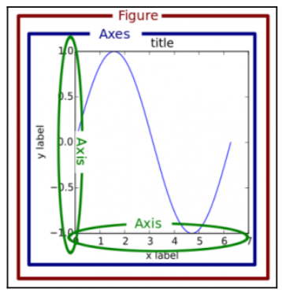

# Markdown in Jupyter and R

Ustawiając zawartość komórki jako Markdown możesz generować opisy swoich kodów. Język Markdown jest językiem znaczników podobnym do HTML czy Latex. Kod napisany w html i LateX również jest przetwarzany w notatniku, także pisząc w Markdown możesz tak naprawdę posługiwać się wszystkimi tymi językami. Specyfikację oraz info możesz znaleźć [tutaj](http://daringfireball.net/projects/markdown/).

Ściągnij [Plik](notebooks/Markdown.ipynb) i otwórz go.

Komórkę w notatniku uruchamiamy wciskając _Shift+Enter_.


# Przestrzeń robocza

1. Środowisko Python3. Jeśli jeszcze nie masz [Python3](https://www/python.org)

2. Katalog roboczy do którego skopiowałeś ten notebook oraz plik z danymi.

```bash
export ML_PATH="$HOME/projekt1"
mkdir -p $ML_PATH
``` 

3. Potrzebne są dla nas następujące moduły (szczególnie jeśli dodałeś środowisko wirtualne do swojego projektu): Jupyter, NumPy, Pandas, Matplotlib i Scikit-Learn. 

```bash
pip --version
pip3 --version

pip3 install --upgrade pip 

# jeśli masz virtualenv
pip3 install --upgrade virtualenv
# stworz środowisko
cd $ML_PATH
virtualenv env
# a jeśli chcesz uruchomić to 
cd $ML_PATH
source env/bin/activate

# instalacja modułów
pip3 install --upgrade jupyter matplotlib numpy pandas scipy scikit-learn
# weryfikacja czy działa
python3 -c "import jupyter, matplotlib, numpy, pandas, scipy, sklearn"
```

# Python Basics

Za uruchomienie danego języka programowania odpowiada tzw. Kernel, kóry jest uruchamiany automatycznie po uruchomieniu pierwszej komórki.

```python
a = 10
print(a)
```

> Python rozróżnia wielkość liter (ang. _case sensitive_).

Notatnik działa jak konsola, także aby uruchomić polecenia konsolowe nie musisz przechodzić do terminala

```python
!pwd # Mac, Linux
!ls # Mac, Linux
!dir # dla windowsa
# co ciekawe bash i pythona można łączyć
message = "Hello World!"
!echo $message
```

Korzystać również można z automatycznego uzupełniania po wciśnięciu _tab_:

```python
import numpy
numpy.random.  #use tab
```

Zgłaszane są również wszystkie wyjątki:

```python
x = 1
y = 4
z = y/(1-x)
```

W Jupyterze masz dostęp do wielu komend _magicznych_.

```python
%load?
%matplotlib inline
%timeit
```

Gdybyś szybko potrzebował coś zapisać do pliku:

```python
%%file data.csv
Date,Open,High,Low,Close,Volume,Adj Close
2012-06-01,569.16,590.00,548.50,584.00,14077000,581.50
2012-05-01,584.90,596.76,522.18,577.73,18827900,575.26
2012-04-02,601.83,644.00,555.00,583.98,28759100,581.48
2012-03-01,548.17,621.45,516.22,599.55,26486000,596.99
2012-02-01,458.41,547.61,453.98,542.44,22001000,540.12
2012-01-03,409.40,458.24,409.00,456.48,12949100,454.53
```

A teraz LateX

```python
%%latex
\begin{aligned}
\nabla \times \vec{\mathbf{B}} -\, \frac1c\, \frac{\partial\vec{\mathbf{E}}}{\partial t} & = \frac{4\pi}{c}\vec{\mathbf{j}} \\
\nabla \cdot \vec{\mathbf{E}} & = 4 \pi \rho \\
\nabla \times \vec{\mathbf{E}}\, +\, \frac1c\, \frac{\partial\vec{\mathbf{B}}}{\partial t} & = \vec{\mathbf{0}} \\
\nabla \cdot \vec{\mathbf{B}} & = 0
\end{aligned}

# lub
from IPython.display import Latex
Latex(r"""\begin{eqnarray}
\nabla \times \vec{\mathbf{B}} -\, \frac1c\, \frac{\partial\vec{\mathbf{E}}}{\partial t} & = \frac{4\pi}{c}\vec{\mathbf{j}} \\
\nabla \cdot \vec{\mathbf{E}} & = 4 \pi \rho \\
\nabla \times \vec{\mathbf{E}}\, +\, \frac1c\, \frac{\partial\vec{\mathbf{B}}}{\partial t} & = \vec{\mathbf{0}} \\
\nabla \cdot \vec{\mathbf{B}} & = 0
\end{eqnarray}""")
# a może tak
from IPython.display import Math
Math(r'F(k) = \int_{-\infty}^{\infty} f(x) e^{2\pi i k} dx')
```

## Wcięcia

Wcięcia w pythonie są bardzo istotne, za to brak nawiasów klamrowych określających bloki kodu.

```python
listOfNumbers = [1, 2, 3, 4, 5, 6]
for number in listOfNumbers:
    print(number)
    if (number % 2 == 0):
        print("is even")
    else:
        print("is odd")
print ("All done.")
```

## Operacje na liczbach

Python obsługuje wszystkie podstawowe **typy skalarne**: _liczby całkowite_, _liczby zmiennoprzecinkowe_, _stałe logiczne_ (True, False). Pamiętaj, iż w pythonie wszystkie typy to obiekty !

```python
1 + 1
2 * 3
1 / 2
2 ** 4
4 % 2
5 % 2
```

## Przypisawanie zmiennych

Zmienne przechowujące dowolne wartości do których możemy odwoływać się podając nazwę zmiennej, tworzymy używając operatora przypisania $=$.

```python
nazwa_zmiennej = 2
x = 3
y = 5
z = x+y
z
napis = "to jest tekst"
napis2 = 'a to inny tekst'
napis
napis2
print(napis)
print(napis,napis2)
num = 12
name = 'Sam'
print('My number is: {one}, and my name is: {two}'.format(one=num,two=name))

print('My number is: {}, and my name is: {}'.format(num,name))
```

## Moduły

```python
import numpy as np

A = np.random.normal(25.0, 5.0, 10)
print (A)
```

## Listy

```python
x = [1, 2, 3, 4, 5, 6]
print(len(x))
['hi',1,[1,2]]
nest = [1,2,3,[4,5,['target']]]
nest[3][2][0]

# indeksowanie
# pierwsze 3 elementy 0:3
x[:3]
# od trzeciego do końca 3:end
x[3:]
# dwa ostatnie 
x[-2:]
# rozszerzanie listy 
x.extend([7,8])
x

x.append(9)
x
# listy list
y = [10, 11, 12]
listOfLists = [x, y]
listOfLists
y[1]
# sortowanie
z = [3, 2, 1]
z.sort()
z

z.sort(reverse=True)
z
```

## Tuple, Krotki

```python
# Tuples are just immutable lists. Use () instead of []
x = (1, 2, 3)
len(x)
y = (4, 5, 6)
y[2]
listOfTuples = [x, y]
listOfTuples
(age, income) = "32,120000".split(',')
print(age)
print(income)
# You can use also
x = 1, 2, 4
print(x)
# try this
x[1] = -2
```

## Sets

```python
{1,2,3}
{1,2,3,1,2,1,2,3,3,3,3,2,2,2,1,1,2}
```

## Słowniki

```python
d = {'key1':'item1','key2':'item2'}
d['key1']
# Like a map or hash table in other languages
captains = {}
captains["Enterprise"] = "Kirk"
captains["Enterprise D"] = "Picard"
captains["Deep Space Nine"] = "Sisko"
captains["Voyager"] = "Janeway"

print(captains["Voyager"])

# metoda get
print(captains.get("Enterprise"))
print(captains.get("NX-01"))

# pętla po elementach
for ship in captains:
    print(ship + ": " + captains[ship])
```

## Flow, instrukcje warunkowe

```python
if 1 < 2:
    print('yep!')

if 1 < 2:
    print('first')
else:
    print('last')

if 1 == 2:
    print('first')
elif 3 == 3:
    print('middle')
else:
    print('Last')
```

## Pętle

```python
for x in range(10):
    print(x)

for x in range(10):
    if (x is 1):
        continue
    if (x > 5):
        break
    print(x) 

x = 0
while (x < 10):
    print(x)
    x += 1

seq = [1,2,3,4,5]
for item in seq:
    print(item)
```

## Funkcje

```python
def SquareIt(x):
    return x * x

print(SquareIt(2))

#You can pass functions around as parameters
def DoSomething(f, x):
    return f(x)

print(DoSomething(SquareIt, 3))

#Lambda functions let you inline simple functions
print(DoSomething(lambda x: x * x * x, 3))
```

## Operatory porównania i logiczne

```python
1 > 2
print(1 == 3)
print(True or False)
if 1 is 3:
    print("How did that happen?")
elif 1 > 3:
    print("Yikes")
else:
    print("All is well with the world")

(1 > 2) and (2 < 3)
(1 == 2) or (2 == 3) or (4 == 4)
```

## Metody

```python
st = 'hello my name is Sam'
st.lower()
st.upper()
st.split()
tweet = 'Go Sports! #Sports'
tweet.split('#')
d = {'key1': 'item1', 'key2': 'item2'}
d.keys()
d.items()
'x' in [1,2,3]
'x' in ['x','y','z']
```

## Klasy i obiekty

```python
class Test():
    pass

a1 = Test()
b2 = Test()

```

Przykład 1

```python
class Figura():
    '''First class'''
    def __init__(self, x ,y):
        self.x = x
        self.y = y

    def info(self):
        print(self.x, self.y)

    def zmien(self, x, y):
        self.x = x
        self.y = y
    
    def przesun(self, dx, dy):
        self.info()
        self.x, self.y = self.x+dx, self.y + dy
        self.info()

o = Figura(1,-2)
o.info()
o.zmien(2,4)
o.info()                
```

Przykład 2 (Dziedziczenie)

```python
class Okrag(Figura):
    def __init__(self, x, y, r=1):
        super().__init__(x, y)
        self.r = r

    def info(self):
        print(f'x={self.x}, y={self.y}, r={self.r}')


ok = Okrag(0,0,3)
ok.info()
ok.przesun(10,15)           
```


## Biblioteka matplotlib

**Przypomnienie** jeśli nie masz pakietu matplotlib to go zainstaluj.

```bash
pip install matplotlib    
```

### Ładowanie pakietu matplotlib


```python
import matplotlib.pyplot as plt
# dla jupytera
%matplotlib inline
```

Narysujmy pierwszy wykres z wykorzystniem listy.

Biblioteka ta korzysta z dwóch różnych sposobów generowania wykresów:

Pierwszy to podejscie imperatywne a drugie w pełni obiektowe.


```python
# pierwszy wykres
squares = [1,4,9,16,25]
plt.plot(squares)
# uruchom podlgąd
plt.show()
```


```python
x = [-3, 5, 7]
y = [10, 2, 5]
plt.figure(figsize=(15,3))
plt.plot(x, y)
plt.xlim(0, 10) # zasięg oś x 
plt.ylim(-3, 8) # zasięg oś y
plt.xlabel('X Axis') # nazwa osi x
plt.ylabel('Y axis') # nazwa osi y
plt.title('Line Plot') 
plt.suptitle('Figure Title', size=20, y=1.03)
# plt.savefig('test.png') # zapis do pliku
```


#### Gdzie te obiekty ?

Pakiet matplotlib można zamknąć w następującym obrazku:




Zaimportuj moduł matplotlib

```python
import matplotlib.pyplot as plt
```

Stwórz instancje dwóch obiektów:
```python
fig, ax = plt.subplots(nrows=1, ncols=1)
```

Sprawdź co wychodzi z następujących komend:

```python

type(fig)
type(ax)
fig.get_size_inches()
fig.set_size_inches(14,4)
fig
fig.set_facecolor('.9')
ax.set_facecolor('.7')
# mozna tez tak S
plot_objects = plt.subplots(2,4)

```

Przykład jeszcze raz: 

```python
fig, ax = plt.subplots(figsize=(15,3))
ax.plot(x, y)
ax.set_xlim(0, 10)ax.set_ylim(-3, 8)
ax.set_xlabel('X axis')
ax.set_ylabel('Y axis')
ax.set_title('Line Plot')
fig.suptitle('Figure Title', size=20, y=1.03)
```


# Pierwsza klasa

```python
from random import randint

class Die(object):
	"""Pojedyncza kość do gry"""
	def __init__(self, num_sides = 6):
		"""Kość to zazwyczaj sześcian"""
		self.num_sides = num_sides
	
	def roll(self):
	    """Zwraca wartość 1 do liczby ścianek losowo"""
	    return randint(1,self.num_sides)


# PROGRAM
die = Die()

results = []
for roll_num in range(100):
	result = die.roll()
	results.append(result)

print(result)		    		
```

> **Zadanie** Napisz program realizujący 100 rzutów dwoma kośćmi. Policz częstotliwości wykorzystując metodę `count()`

## Druga klasa - Błądzenie losowe

```python

from random import choice
class RandomWalk(object):
	"""generowanie błądzenia losowego"""
	def __init__(self, num_points=5000):
		self.num_points = num_points
		self.x_values = [0]
		self.y_values = [0]

	def fill_walk(self):
		while len(self.x_values) < self.num_points:
			x_direction = choice([-1,1])
			x_distance = choice([0,1,2,3,4])
			x_step = x_direction*x_distance

			y_direction = choice([-1,1])
			y_distance = choice([0,1,2,3,4])
			y_step = y_direction*y_distance

			if x_step == 0 and y_step == 0:
			    continue

			next_x = self.x_values[-1] + x_step
			next_y = self.y_values[-1] + y_step

			self.x_values.append(next_x)
			self.y_values.append(next_y)
```

Zapisz klasę `RandomWalk` do pliku rand_w.py


#### program 1
```python


import matplotlib.pyplot as plt
from rand_w import RandomWalk

rw = RandomWalk()
rw.fill_walk()

plt.scatter(rw.x_values, rw.y_values, s=15)
plt.show()
```

#### Program 2
```python
rw = RandomWalk()
rw.fill_walk()

point_number = list(range(rw.num_points))
plt.scatter(rw.x_values,rw.y_values, c=point_number, cmap=plt.cm.Blues, edgecolor='none', s=15)
plt.scatter(0,0,c='green', edgecolor='none',s=100)
plt.scatter(rw.x_values[-1],rw.y_values[-1], c='red',edgecolor='none', s=100)
plt.axes().get_xaxis().set_visible(False)
plt.axes().get_yaxis().set_visible(False)
plt.show()
```
#### Program 3

```python
rw = RandomWalk(50000)
rw.fill_walk()

point_number = list(range(rw.num_points))
plt.scatter(rw.x_values,rw.y_values, c=point_number, cmap=plt.cm.Blues, edgecolor='none', s=1)
plt.scatter(0,0,c='green', edgecolor='none',s=100)
plt.scatter(rw.x_values[-1],rw.y_values[-1], c='red',edgecolor='none', s=100)
plt.axes().get_xaxis().set_visible(False)
plt.axes().get_yaxis().set_visible(False)
plt.show()
```

## Zbiory danych

Odpowiednie przygotowanie danych to $80%$ czasu pracy nad modelowaniem i wydobywaniem informacji z danych.

### Przykładowe zbiory danych z pakietu scikit-learn

W pakiecie [scikit-learn](http://scikit-learn.org/stable/datasets/index.html) znajduje się moduł z prostymi przykładowymi zbiorami danych. Można je łatwo zaimportować w Pythonie za pomocą instrukcji import. Zbiory te to np. Iris, Boston itp. Są to najczęściej wymieniane zbiory w wielu publikacjach, książkach i kursach.

Zbiory te mają postać obiektów (słowników w Pythonie) i oprócz cech, zmiennych docelowych obejmują kompletny opis oraz objaśnienie kontekstu danych.

Zaczniemy od zbioru **IRIS**.

```python
import matplotlib.pyplot as plt
import pandas as pd
import numpy as np
%matplotlib inline


from sklearn import datasets
iris = datasets.load_iris()
```

Wszystkie zbiory z pakietu scikit-learn udostępniają następujące pola:

```python
print(iris.DESCR) # opis danych
print(iris.data)  # features, cechy
print(type(iris.data)) # tablica NumPy ndarray
print(iris.data.shape) # rozmiar tablicy zwraca tuple
print(iris.feature_names) # lista nazw dla iris.data
print(iris.target)  # zmienna celu (target)
print(iris.target.dtype) # tablica NumPy
print(iris.target.shape) # rozmiary tablicy celu
```

> **Zadanie** Wczytaj dane Iris 

główne struktury danych z obiektu _iris_ to _data_ i _target_.

iris.data zawiera **wartości liczbowe** zmiennych (zgodnie z listą *iris.feature_names*) sepal length, sepal width, petal length, petal width uporządkowane w macierz ($150 \times 4$), gdzie 150 to liczba obserwacji a 4 to liczba cech.

iris.target zawiera wektor wartości całkowitoliczbowych reprezentujących odpowiednie klasy (zgodnie z *iris.target_names*).

Zbiór ten często wykorzystuje się ze względu na łatwość wczytania, obsługi i eksploracji do nauczania nadzorowanego, nienadzorowanego czy graficznej prezentacji danych. Modele na tych danych tworzy się bardzo szybko.

```python
colors = []
palette = {0:"red", 1:"green", 2:"blue"}
for c in np.nditer(iris.target):
    colors.append(palette[int(c)])
df = pd.DataFrame(iris.data, columns=iris.feature_names)
sc = pd.plotting.scatter_matrix(df, alpha=0.3, figsize=(10,10), diagonal="hist", color=colors, marker="o", grid="True")
```

Mimo, iż zbiory te są bardzo przydatne w trakcie nauki bardzo często będziesz musiał zajmować się złożonymi i rzeczywistymi danymi. Stąd potrzebna będzie nam wiedza jak wczytywać dane zewnętrzne.


### Generowanie danych sztucznych

Pakiet scikit-learn umożliwia szybkie wygenerowanie zbiorów danych na potrzeby regresji, klasyfikacji, analizy klastrów czy redukcji liczby wymiarów. Dane generowane są bezpośrednio do pamięci stąd nie trzeba ich pobierać z internetu ani przetrzymywać na dysku.

```python
from sklearn import datasets
%%timeit
X,y = datasets.make_classification(n_samples=10**6, n_features = 10, random_state=1234)
print(X.shape, y.shape)
```

Dzięki zastosowaniu konkretnej wartości random_state uzyskasz te same dane na dowolnym innym komputerze.


## Sprawdzamy dane

Załaduj wszystkie biblioteki:

```python
import pandas as pd

#models
from sklearn.dummy import DummyClassifier
from sklearn.linear_model import LogisticRegression
from sklearn.tree import DecisionTreeClassifier
from sklearn.ensemble import RandomForestClassifier

#success metric
from sklearn.metrics import accuracy_score 

import matplotlib.pyplot as plt
%matplotlib inline
```

Ściągnij i wczytaj [dane](data/polish_names.csv).

```python
df = pd.read_csv("polish_names.csv")
```

Na początek chcemy poznać jakie dane mamy do dyspozycji:
1. Ile jest wierszy (wszystkich obiektów)?
2. Ile jest kolumn (cechy obiektów)?
3. Czy są braki w danych?
4. Która zmienna jest zmienną docelową (*target variable*)?
5. Jaki problem jest do rozwiązania (klasyfikacja czy regresja)?
6. W przypadku klasyfikacji, jakie unikalne wartości ma zmienna docelowa (dwie czy więcej)?
7. Jak wygląda rozkład unikalnych wartości (czy jest mniej więcej po równo, czy jednak są bardzo popularne/rzadkie klasy)?

```python
df.info()
```

1. Druga linia "mówi": `1705 entries`, to jest ilość wierszy (obiektów).
2. Trzecia linia "mówi": `total 2 columns`, co oznacza że mamy 2 kolumny (cechy).
3. Następnie mamy informację o każdej kolumnie i ilość wartości (`non-null`), w tym przypadku nie ma brakujących danych. 
4. Zmienną docelową (en. `target variable`) jest kolumna `gender`


```python
df.gender.value_counts()
```

5. W tym przypadku problemem jest klasyfikacja (skończona liczba w odpowiedzi)
6. Klasyfikacja binarna (odpowiedź ma stwierdzić, czy imię jest męskie czy żeńskie)
7. 1033 męskich imion oraz 672 żeńskich


### Jak wyglądają dane?
Zobacz pierwszych 10 wierszy (używając funkcję `head`). Parametr 10 oznacza ile wierszy chcesz wyświetlić. Jeśli nie podasz tego parametru, to będzie domyślny (spróbuj samo `df.head()`).

```python
df.head(10)
```

Możesz użyć funkcji `sample()`, która działa podobnie do `head()`, jedynie zamiast pobierać wiersze z początku listy, losuje je. Dzięki czemu, jeśli odpalisz kilka razy, to możesz zobaczyć więcej przykładów.

```python
df.sample(10)
```

- Kolumna `name` zawiera imię i czasem są dość ciekawe :).
- Kolumna `gender` zawiera płeć, gdzie `m` oznacza **męskie imię**, a `f` - **żeńskie imię**

Sprawdźmy, jaki jest rozkład męskich i żeńskich imion.

```python
df['gender'].value_counts()
```

- Męskich imion jest prawie 2 razy więcej (1033 do 672). 

Model oczekuje na reprezentację liczbową zamiast słowną. Dlatego teraz musimy to przekształcić: 
* 'f' => 0
* 'm' => 1

Do tego użyjemy funkcji `.map()`.

```python
def transform_string_into_number(string):
    return int(string == 'm')
    
df['gender'].head().map( transform_string_into_number )
```

Zapiszmy wynik działania funckji do nowej zmiennej `target`.
Tym razem do otrzymania wyniku użyjemy wyrażenia lambda.

```python
df['target'] = df['gender'].map(lambda x: int(x == 'm'))
df.head(10)
```

### Feature enginneering

Załóżmy, że cechą na podstawie której będziemy chcieli wyznaczyć czy imię jest męskie czy żeńskie będzie długość imienia.

> **Zadanie** Stwórz zmienną (kolumnę), która będzie przechowywać informację o długości imienia.


```python 
df['len_name'] = df['name'].map(lambda x: len(x))
```

## Twój pierwszy model 

Nie wnikając na razie w same modele nauczmy się jak w bibliotece `sklearn` tworzy się modele. 

```python
# tablica zmiennych na podstawie których chcemy przeprowadzić analizę
X = df[ ['len_name'] ].values
# wyniki dla uczenia z nadzorem
y = df['target'].values
# wybierz model 
model = DummyClassifier()
# dopasuj model do danych
model.fit(X, y)
# stwórz tablicę z predykcjami  
y_pred = model.predict(X)
# zobacz ile predykcji model dobrze oznaczył
accuracy_score(y, y_pred)
```

Problem klasyfikacji można opisywać liniowym modelem Regresji Logistycznej. 


```python
# tablica zmiennych na podstawie których chcemy przeprowadzić analizę
X = df[ ['len_name'] ].values
# wyniki dla uczenia z nadzorem
y = df['target'].values
# wybierz model 
model = LogisticRegression()
# dopasuj model do danych
model.fit(X, y)
# stwórz tablicę z predykcjami  
y_pred = model.predict(X)
# zobacz ile predykcji model dobrze oznaczył
accuracy_score(y, y_pred)
```

> **Zadanie** Znajdź inne cechy i wygeneruj z nich swoje modele. 